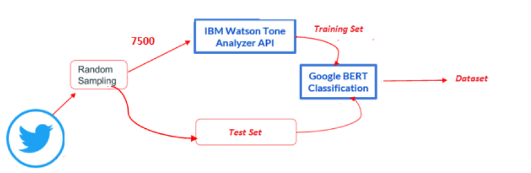

# EmotionSentimentAnalysis
Creation of a system that performs sentiment and emotion analysis using a dataset of COVID-19-related tweets obtained from: https://crisisnlp.qcri.org/. The technology stack used includes: Twarc, MongoDB, Spark, Spark-NLP using John Snowlab models, IBM Watson, and Huggingface BERT.
# Data acquisition and extraction
The tweets were acquired from the website using the ID file available at: https://crisisnlp.qcri.org/.
A sampling technique was employed, extracting 0.5% of the tweets related to Covid-19.
Using the sampled IDs, hydration was performed using the Twarc library, with the resulting JSON data being stored in MongoDB. The hydration process took approximately 48 hours. To optimize query speed and filtering, a collection was created for each month. Only English-language tweets were retained. Subsequently, the concatenated JSON file representing the dataset was exported for utilization within the system.
# Data engineering and classification using SPARK
Databricks, utilizing a community license, was employed for this purpose. The dataset was uploaded and a cluster was created and initialized with the Spark environment. The data was loaded into a Spark dataframe, and special characters and stopwords were replaced. Subsequently, a data preprocessing pipeline was created, which involved tokenization using the UniversalSentenceEncoder. The obtained sentence embeddings were then fed into the sentiment model provided by JohnSnowLab Spark NLP, resulting in the polarity of the tweets being determined.
# Emotion Analysis using IBM Watson and BERT
In order to go beyond simple sentiment polarity calculation, we performed emotions analysis, identifying anger, sadness, joy, rationality, security, and uncertainty.
The workflow used is as follows:

- Automatic creation of a training set of labeled tweets with emotions using the IBM Watson Tone Analyzer service through APIs. This choice was made due to the pricing of IBM's service.

- The training set was then used to fine-tune BERT on Google Colab. In this case, a binary classification of 0 or 1 was implemented for each emotion.

